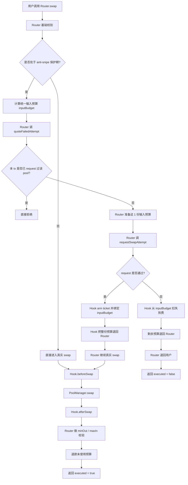
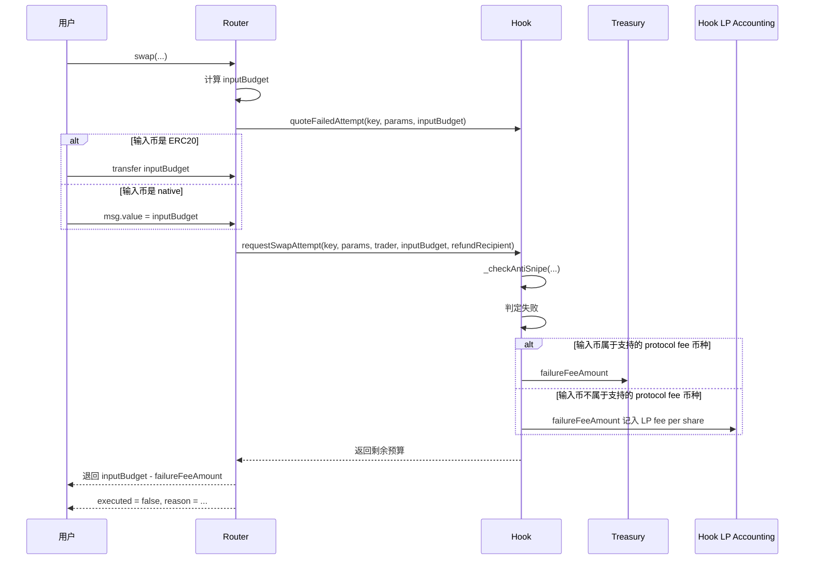
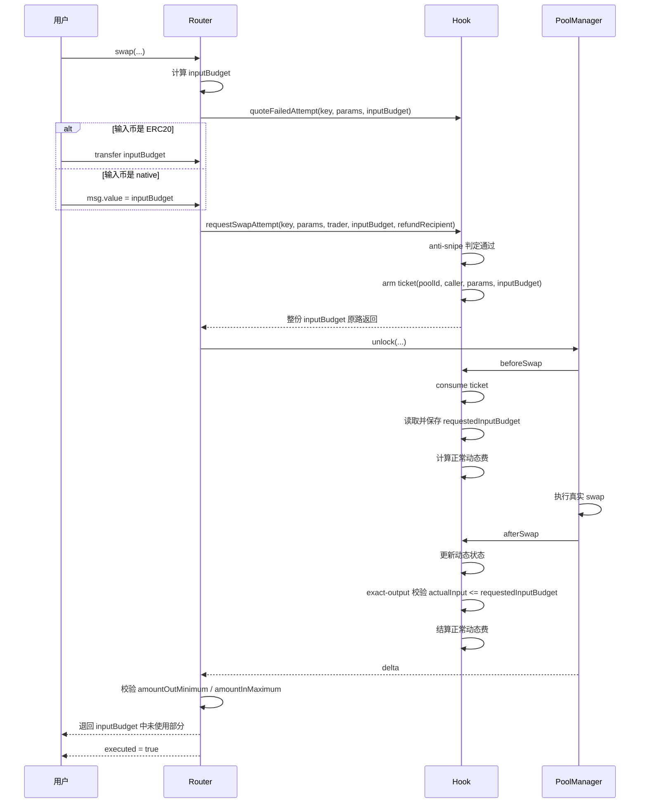
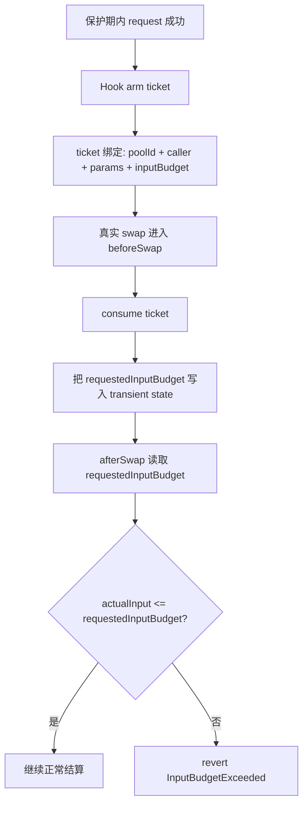
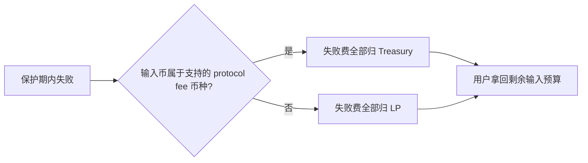

# Memeverse Swap 流程图

本文档聚焦当前 `swap` 主路径的执行与资金流，不展开 LP、claim fee、bootstrap 等其他路径。

相关实现主要位于：

- `src/verse/MemeverseSwapRouter.sol`
- `src/verse/MemeverseUniswapHook.sol`
- `src/libraries/MemeverseTransientState.sol`

---

## 1. 总体执行流



---

## 2. 统一输入预算模型

保护期内不再区分“swap 预算”和“失败费预算”，而是统一成一份输入预算。

```mermaid
flowchart TD
    A[Router 进入保护期逻辑] --> B{交易类型}
    B -- exact-input --> C[inputBudget = abs(amountSpecified)]
    B -- exact-output --> D[inputBudget = amountInMaximum]

    C --> E{输入币是否为 native?}
    D --> E

    E -- 是 --> F[msg.value = inputBudget]
    E -- 否 --> G[Router 从用户 pull inputBudget ERC20]

    F --> H[requestSwapAttempt 使用这同一份预算]
    G --> H
```

说明：

- exact-input：总预算等于用户愿意支付的输入数量
- exact-output：总预算等于用户设置的 `amountInMaximum`
- 失败费与成功成交都从这同一份预算里结算
- exact-output 时，失败费按预计实际输入计费，`amountInMaximum` 只作为预算上限

---

## 3. 保护期失败路径资金流



说明：

- 失败时不会执行真实 swap
- 失败费统一从输入侧收
- 输入币属于支持的 protocol fee 币种时，失败费全部归 `treasury`
- 否则失败费全部归 LP

---

## 4. 保护期成功路径资金流



说明：

- 成功时不收失败费
- 成功时只走正常 swap 动态费
- 未使用的输入预算会退回用户

---

## 5. 预算绑定到 ticket

成功 request 后，ticket 不仅绑定 `poolId + caller + params`，还绑定 `inputBudget`。



这个绑定用于防止：

- 小预算 request
- 成功后拿大预算成交

尤其是 exact-output 路径，会在 `afterSwap` 用真实输入额做最终校验。

---

## 6. 失败费归属流向



---

## 7. 超简版摘要

```mermaid
flowchart TD
    A[保护期外] --> B[直接 swap]
    B --> C[正常动态费]

    D[保护期内] --> E[先 requestSwapAttempt(inputBudget)]
    E --> F{是否失败?}
    F -- 是 --> G[从 inputBudget 扣 failureFee]
    G --> H[退回剩余预算]
    F -- 否 --> I[不收 failureFee]
    I --> J[继续真实 swap]
    J --> K[按正常动态费结算]
    K --> L[退回未使用预算]
```

一句话概括：

- 保护期外：直接正常 swap
- 保护期内：先用同一份输入预算请求 ticket
  - 失败：扣失败费，剩余退回
  - 成功：不扣失败费，继续真实 swap，按正常动态费结算
