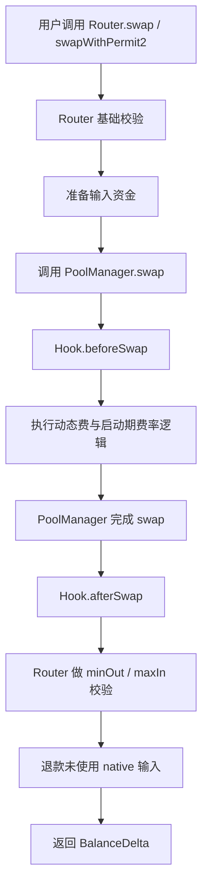
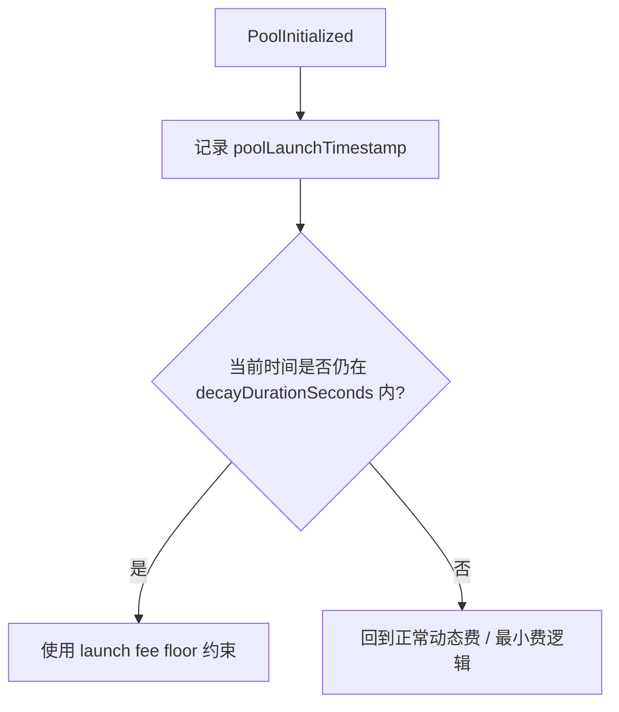
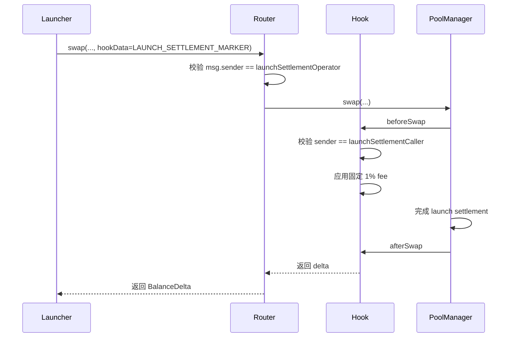
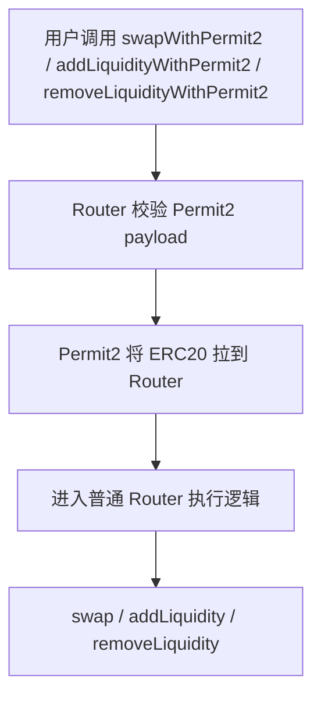
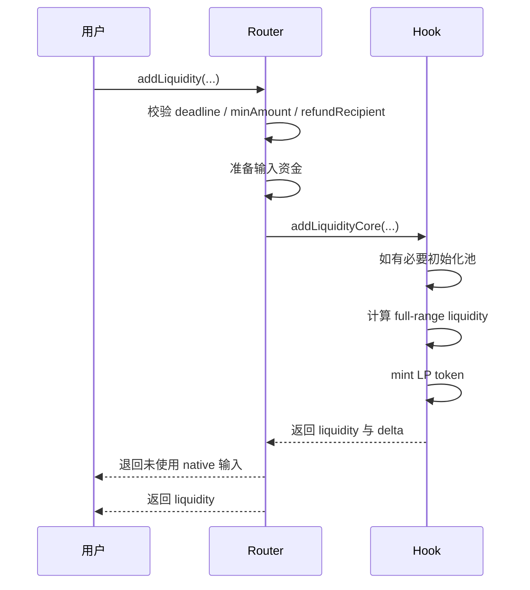
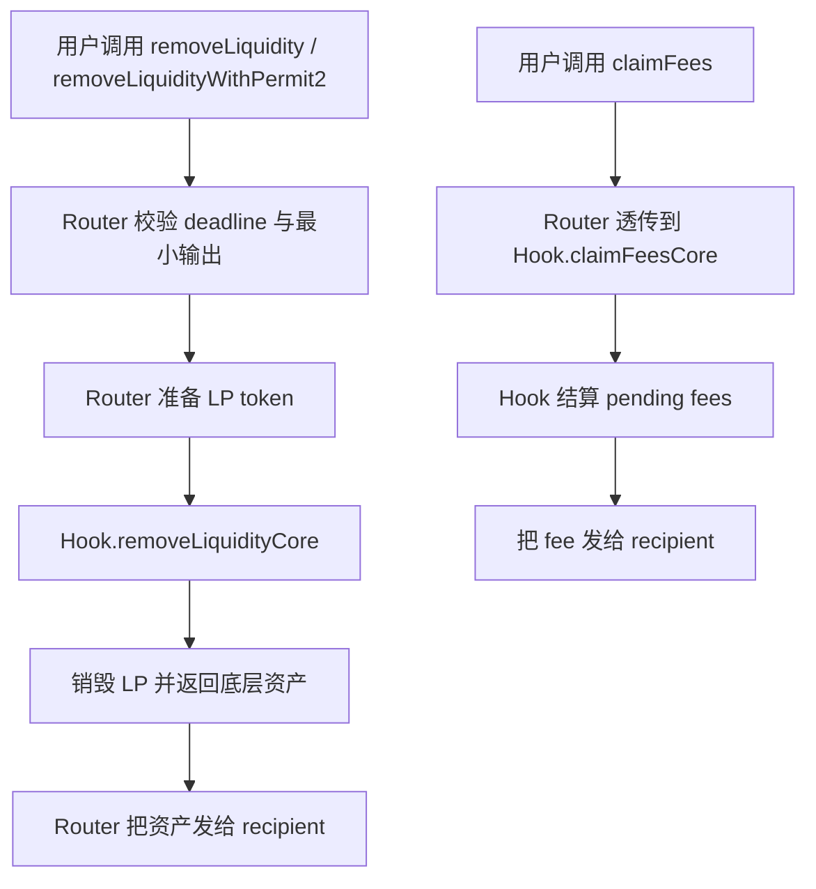
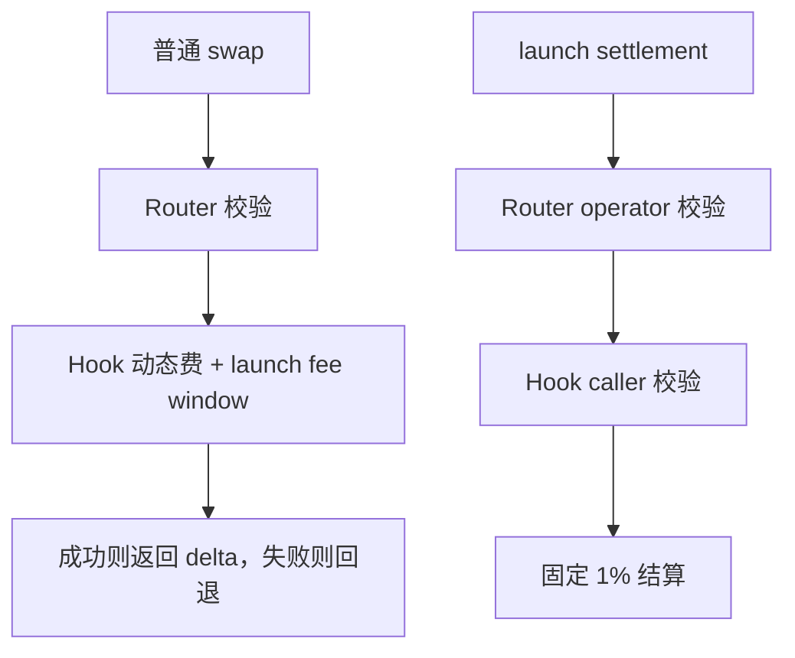

# Memeverse Swap 流程图

本文档聚焦当前 `swap`、`launch settlement` 与 LP 主路径的执行与资金流，不展开治理、部署与链下流程。
其中资金准备既可来自常规 approve 路径，也可来自 `*WithPermit2(...)`。

相关实现主要位于：

- `src/swap/MemeverseSwapRouter.sol`
- `src/swap/MemeverseUniswapHook.sol`

---

## 1. 总体交易执行流

说明：

- 普通 swap 采用单路径结算。
- 交易要么成功结算，要么整笔回退。
- 启动期保护通过 Hook 内的 `launch fee window` 费率逻辑体现。

---

## 2. 启动期费率窗口

说明：

- 新池初始化后会记录 `poolLaunchTimestamp`。
- 在衰减窗口内，fee 从 `startFeeBps` 逐步下降到 `minFeeBps`。
- 窗口结束后，回到常规动态费与最小费逻辑。

---

## 3. Launch Settlement 特殊通道

说明：

- 这条路径不是普通用户路径。
- Router 与 Hook 各自做一层授权校验。
- 该路径固定总费 `1%`，不复用普通动态费结果。

---

## 4. Permit2 并行资金流

说明：

- Permit2 只改变 ERC20 资金准备方式。
- 一旦资金到达 Router，后续业务语义与普通入口完全一致。
- native 资产仍通过 `msg.value` 处理，不经过 Permit2。

---

## 5. Add Liquidity 主路径

---

## 6. Remove Liquidity 与 Claim Fee 主路径

---

## 7. 超简版摘要

一句话概括：

- 普通 swap：execute-or-revert，启动期靠费率衰减保护
- 特殊启动结算：双权限校验，固定 `1%` 费率
