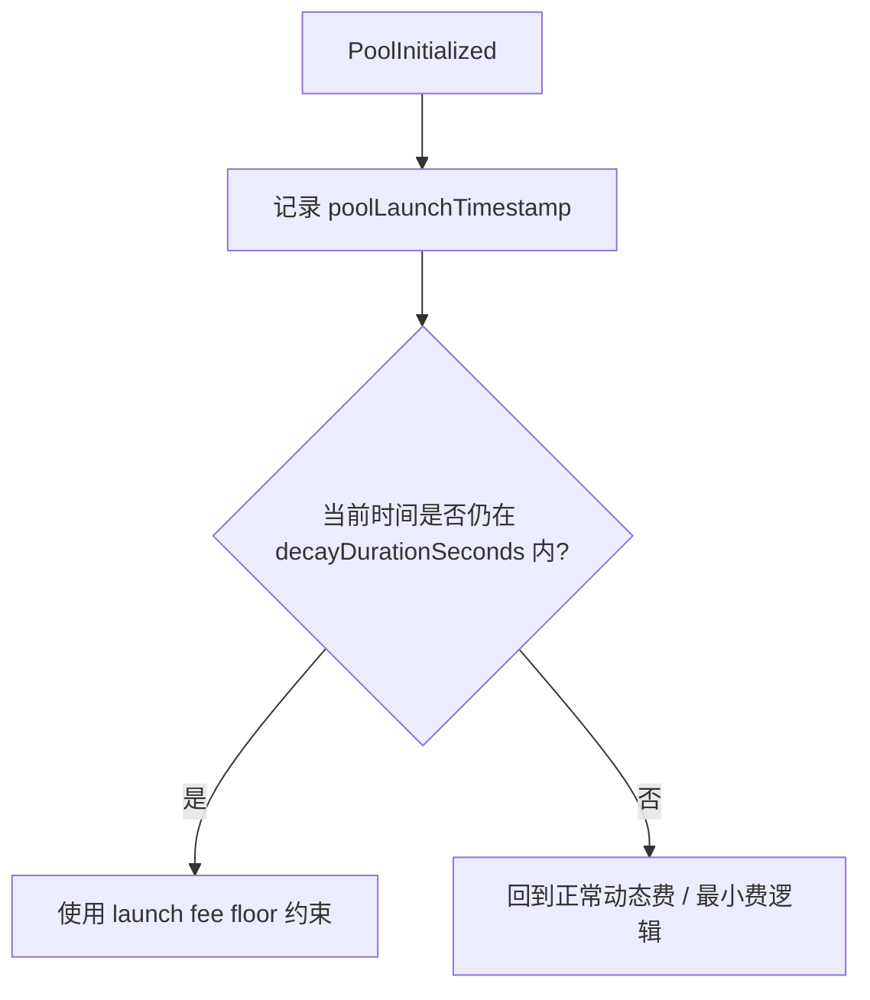
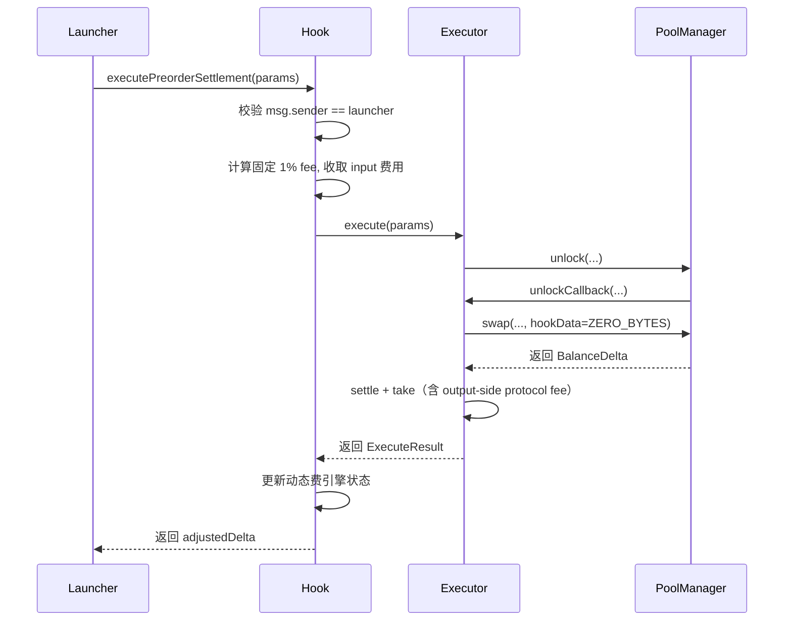
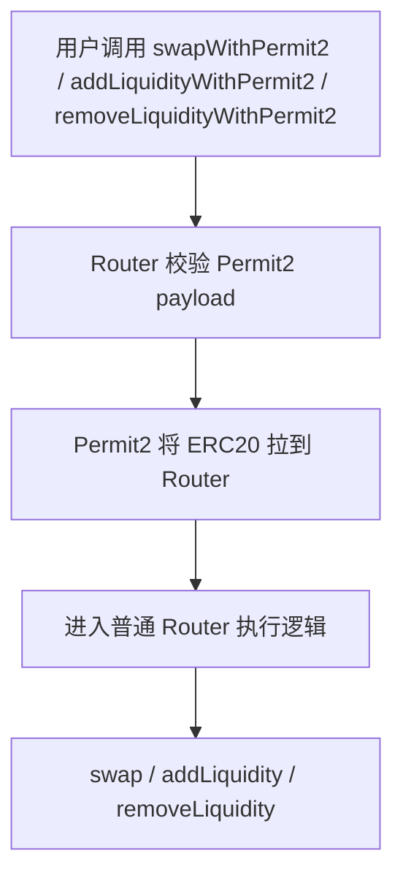
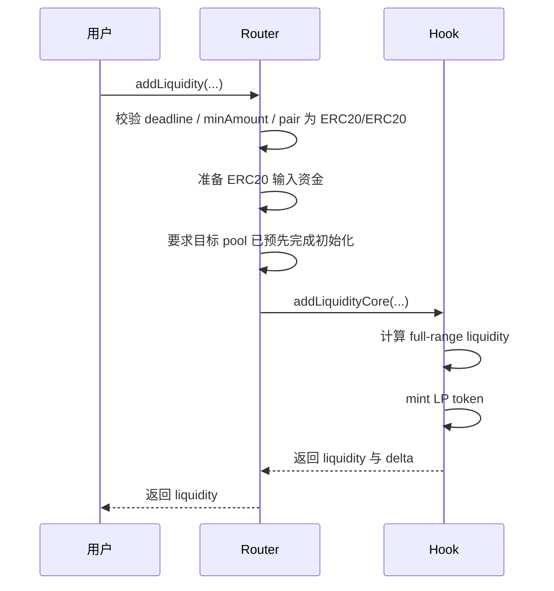
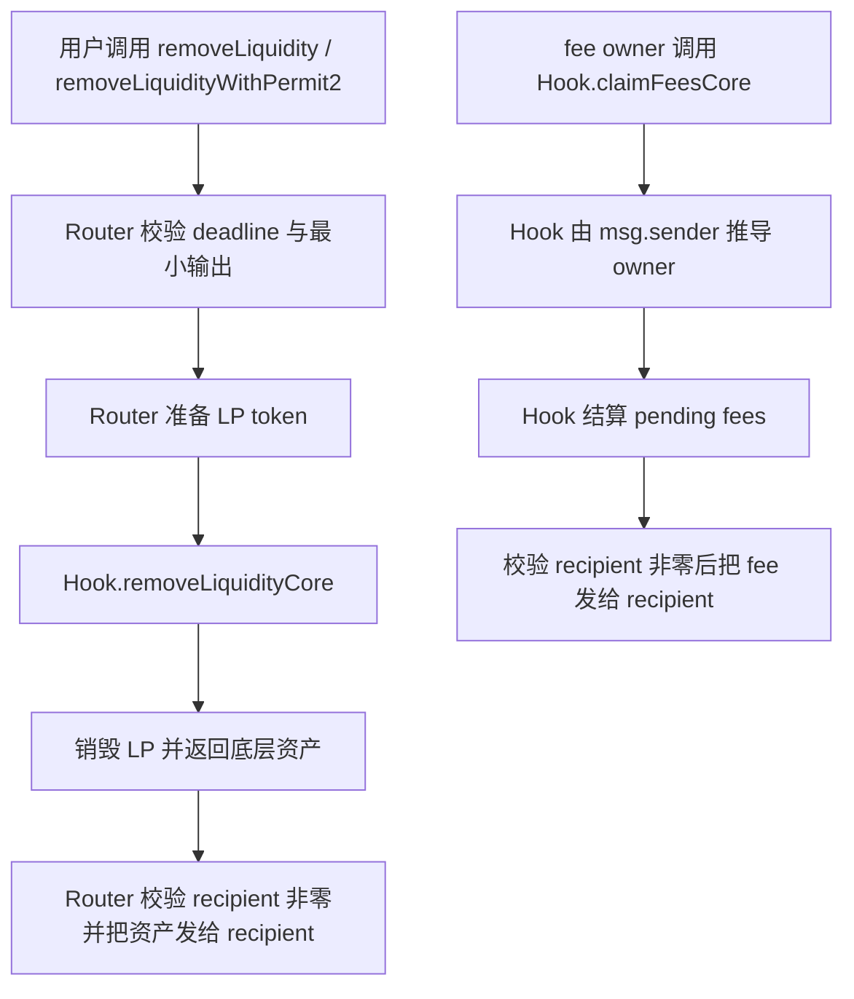

# Memeverse Swap 流程图

本文档聚焦当前 `swap`、`preorder settlement` 与 LP 主路径的执行与资金流，不展开治理、部署与链下流程。
其中资金准备既可来自常规 approve 路径，也可来自 `*WithPermit2(...)`。

相关实现主要位于：

- `src/swap/MemeverseSwapRouter.sol`
- `src/swap/MemeverseUniswapHook.sol`

---

## 1. 总体交易执行流

```mermaid
flowchart TD
    A[用户调用 Router.swap / swapWithPermit2] --> B[Router 基础校验]
    B --> B1{currency0 或 currency1 是否为 address(0)?}
    B1 -- 是 --> BX[revert NativeCurrencyUnsupported]
    B1 -- 否 --> C[准备 ERC20 输入资金]
    C --> D[调用 PoolManager.swap]
    D --> E[Hook.beforeSwap]
    E --> F[执行动态费与启动期费率逻辑]
    F --> G[PoolManager 完成 swap]
    G --> H[Hook.afterSwap]
    H --> I[Router 做 minOut / maxIn 校验]
    I --> K[返回 BalanceDelta]
```

说明：

- 普通 swap 采用单路径结算，execute-or-revert（V10 定义见 [docs/spec/swap/uniswap-v4.md](uniswap-v4.md) §4）。
- swap 栈只支持 ERC20/ERC20 pair；native 拒绝规则（V5）与收费/币种边界见 [docs/spec/swap/uniswap-v4.md](uniswap-v4.md) §3。
- 启动期保护通过 Hook 内的 `launch fee window` 费率逻辑体现。

---

## 2. 启动期费率窗口



说明：

- 新池初始化后会记录 `poolLaunchTimestamp`。
- 在衰减窗口内，fee 从 `startFeeBps` 逐步下降到 `minFeeBps`。
- 窗口结束后，回到常规动态费与最小费逻辑。

---

## 3. Preorder Settlement 显式通道



说明：

- 这条路径不是普通用户路径。
- 启动结算不再经过 Router，也不再依赖特殊 `hookData` marker。
- Hook 将 unlock/swap 逻辑委托给 Executor 合约（constructor 时 immutable 绑定 hook proxy）执行；Executor 持有 unlock 回调上下文，负责 swap、settle、take 与 output-side protocol fee 扣减。
- 该路径使用固定总费（数值定义见 [docs/spec/verse/accounting.md §7.4](../verse/accounting.md)）；caller 约束见 [docs/spec/invariants.md](../invariants.md) INV-04。不复用普通动态费结果。
- **资金与 approve 路径**：Launcher 只需对 Hook 做一次 infinite approve。Hook 作为 `transferFrom` 的 spender，分别拉取 input 费用到自身/treasury 和 netInput 到 Executor；Executor 用自身余额直接 `transfer` 给 PoolManager，不需要任何 approve。详见 [docs/spec/swap/swap-integration.md §5.1](swap-integration.md)。

---

## 4. Permit2 并行资金流



说明：

- Permit2 只改变 ERC20 资金准备方式；Permit2 入口语义（V6）见 [docs/spec/swap/permit2.md](permit2.md)。
- 一旦资金到达 Router，后续业务语义与普通入口完全一致。
- native 拒绝（V5）见 [docs/spec/swap/uniswap-v4.md](uniswap-v4.md) §3。

---

## 5. Add Liquidity 主路径



说明：

- `addLiquidity(...)` / `addLiquidityCore(...)` 不负责初始化 pool，调用前目标 pool 必须已经存在且已初始化。
- 初始建池路径为 `Launcher -> Router.createPoolAndAddLiquidity(...)`。
- bootstrap 由 `Launcher` 先给出 desired budgets，再由 Router 执行 `createPoolAndAddLiquidity(...)`；对外记账真源是实际执行后的 actual spend / actual liquidity。

### 5.1 Bootstrap Execution

- 集成契约：Router 从 Launcher 提交的 desired budgets 执行 `createPoolAndAddLiquidity(...)`，并把 actual spend / actual liquidity 返回给 Launcher 做后续 accounting（bootstrap 不返回 preview-equality 结果）。
- 四池 bootstrap 的记账语义、`memecoin/uAsset` 主池 PT backing ratio 口径、auxiliary underspend 处置、unused bootstrap `uAsset` / `memecoin` 处置见 [docs/spec/verse/accounting.md](../verse/accounting.md) §3.2 与 [docs/spec/invariants.md](../invariants.md) INV-04；PT backing ratio 的记录与 split 操作语义 home 在 [docs/spec/polend/pt-yt-splitter.md §1](../polend/pt-yt-splitter.md)，不变量锚点见 [docs/spec/invariants.md](../invariants.md) INV-14 / INV-19；unused bootstrap `uAsset` 进入的 settlement dust reserve 结构与处置 home 在 [docs/spec/polend/core.md §6.7](../polend/core.md)，该 reserve 与杠杆侧 PT fee 预兑付的关联见 [docs/spec/polend/settlement-and-fees.md §5](../polend/settlement-and-fees.md)。

---

## 6. Remove Liquidity 与 Claim Fee 主路径



说明：

- 上图中两条路径的 `recipient` 非零 fail-close 规则（V7）见 [docs/spec/invariants.md](../invariants.md) INV-07，不在本文档重述。

---

## 7. 超简版摘要

```mermaid
flowchart TD
    A[普通 swap] --> B[Router 校验]
    B --> C{存在 EWVWAP 历史且交易回归 EWVWAP?}
    C -- 是 --> C1[跳过全部动态费组件<br/>effectiveFee = max(baseFee, launchFee)]
    C -- 否 --> C2[Hook 动态费<br/>adverse per-address + vol per-pool + short per-pool<br/>取 max(dynamicFee, launchFee)]
    C1 --> D[成功则返回 delta，失败则回退]
    C2 --> D

    E[preorder settlement] --> F[Launcher 调 Hook.executePreorderSettlement]
    F --> G[Hook 校验 launcher 绑定 + 收取 input 费用]
    G --> H[Executor 执行 unlock/swap/take]
    H --> I[固定 1% 结算]
```

一句话概括：

- 普通 swap：execute-or-revert，启动期靠费率衰减保护
- 特殊启动结算：显式 `Launcher -> Hook -> Executor`，固定费率（数值见 [docs/spec/verse/accounting.md §7.4](../verse/accounting.md)）
