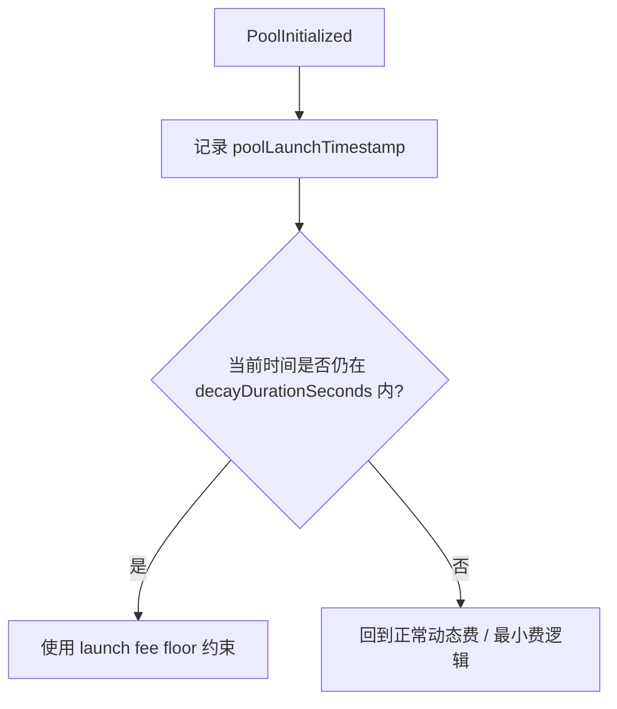
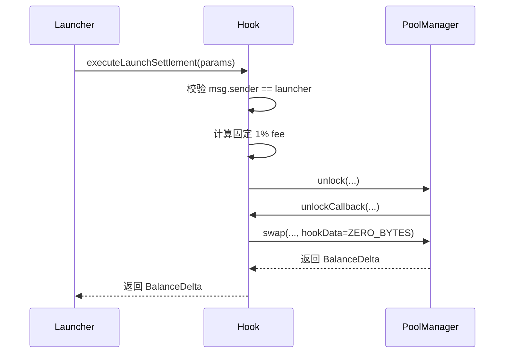
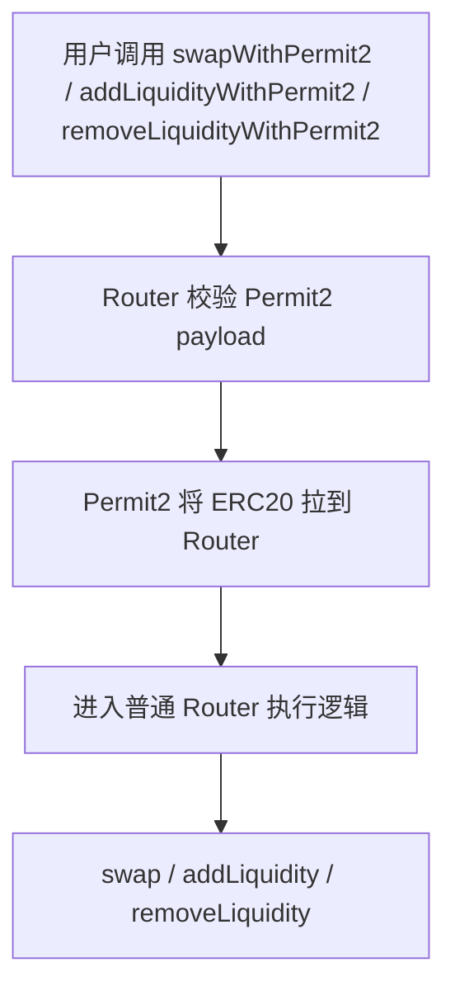
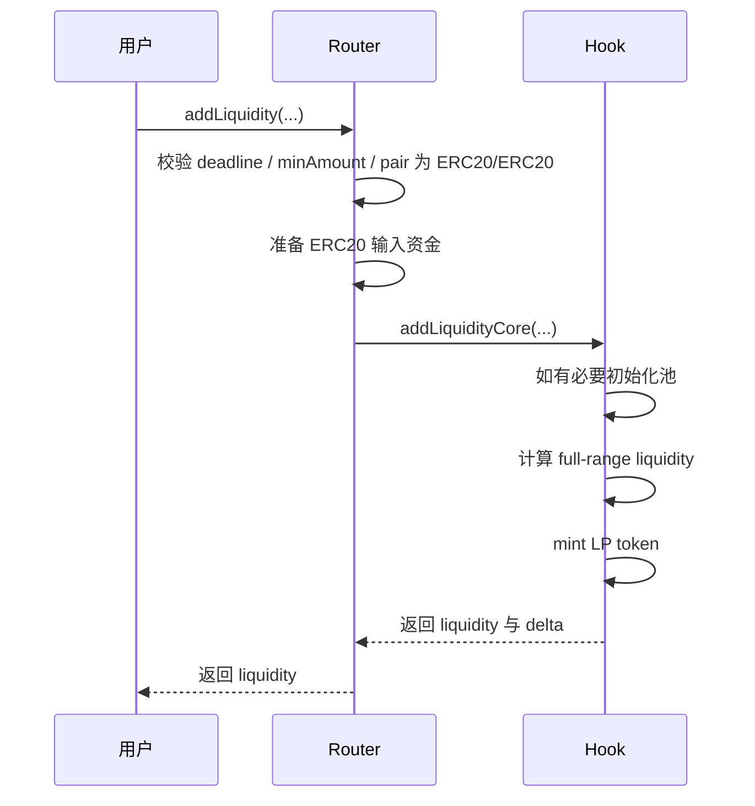
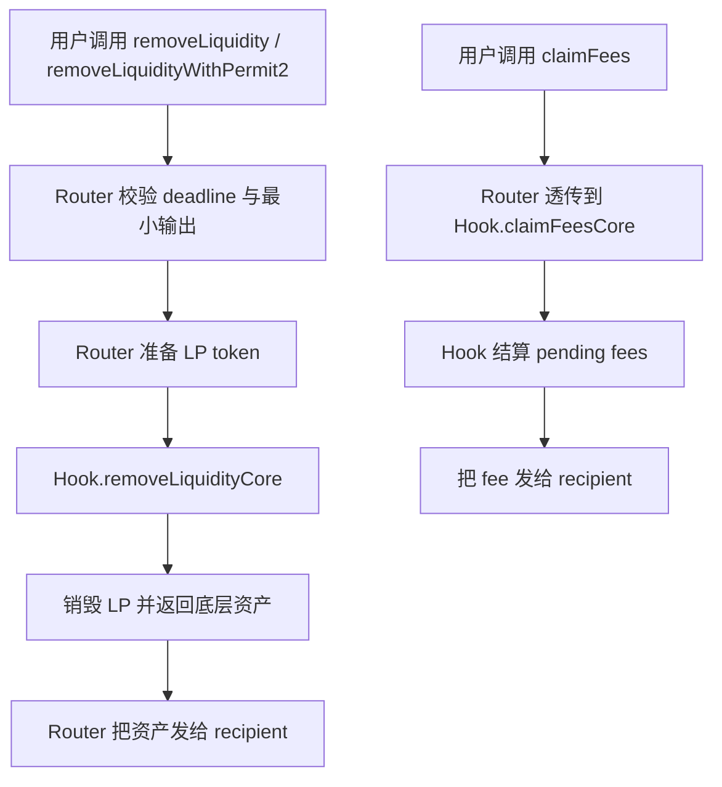

# Memeverse Swap 流程图

本文档聚焦当前 `swap`、`launch settlement` 与 LP 主路径的执行与资金流，不展开治理、部署与链下流程。
其中资金准备既可来自常规 approve 路径，也可来自 `*WithPermit2(...)`。

相关实现主要位于：

- `src/swap/MemeverseSwapRouter.sol`
- `src/swap/MemeverseUniswapHook.sol`

---

## 1. 总体交易执行流

```mermaid
flowchart TD
    A[用户调用 Router.swap / swapWithPermit2] --> B[Router 基础校验]
    B --> B1{currency0 或 currency1 是否为 address(0)?}
    B1 -- 是 --> BX[revert NativeCurrencyUnsupported]
    B1 -- 否 --> C[准备 ERC20 输入资金]
    C --> D[调用 PoolManager.swap]
    D --> E[Hook.beforeSwap]
    E --> F[执行动态费与启动期费率逻辑]
    F --> G[PoolManager 完成 swap]
    G --> H[Hook.afterSwap]
    H --> I[Router 做 minOut / maxIn 校验]
    I --> K[返回 BalanceDelta]
```

说明：

- 普通 swap 采用单路径结算。
- 交易要么成功结算，要么整笔回退。
- swap 栈只支持 ERC20/ERC20 pair；任一侧为 `address(0)` 立即失败。
- 启动期保护通过 Hook 内的 `launch fee window` 费率逻辑体现。

---

## 2. 启动期费率窗口



说明：

- 新池初始化后会记录 `poolLaunchTimestamp`。
- 在衰减窗口内，fee 从 `startFeeBps` 逐步下降到 `minFeeBps`。
- 窗口结束后，回到常规动态费与最小费逻辑。

---

## 3. Launch Settlement 显式通道



说明：

- 这条路径不是普通用户路径。
- 启动结算不再经过 Router，也不再依赖特殊 `hookData` marker。
- 该路径固定总费 `1%`，不复用普通动态费结果。

---

## 4. Permit2 并行资金流



说明：

- Permit2 只改变 ERC20 资金准备方式。
- 一旦资金到达 Router，后续业务语义与普通入口完全一致。
- Permit2 不处理 native；swap 栈也不接受 `msg.value`。

---

## 5. Add Liquidity 主路径



---

## 6. Remove Liquidity 与 Claim Fee 主路径



---

## 7. 超简版摘要

```mermaid
flowchart TD
    A[普通 swap] --> B[Router 校验]
    B --> C{存在 EWVWAP 历史且交易回归 EWVWAP?}
    C -- 是 --> C1[跳过全部动态费组件<br/>effectiveFee = max(baseFee, launchFee)]
    C -- 否 --> C2[Hook 动态费<br/>adverse per-address + vol per-pool + short per-pool<br/>取 max(dynamicFee, launchFee)]
    C1 --> D[成功则返回 delta，失败则回退]
    C2 --> D

    E[launch settlement] --> F[Launcher 调 Hook.executeLaunchSettlement]
    F --> G[Hook 校验 launcher 绑定]
    G --> H[固定 1% 结算]
```

一句话概括：

- 普通 swap：execute-or-revert，启动期靠费率衰减保护
- 特殊启动结算：显式 `Launcher -> Hook`，固定 `1%` 费率
